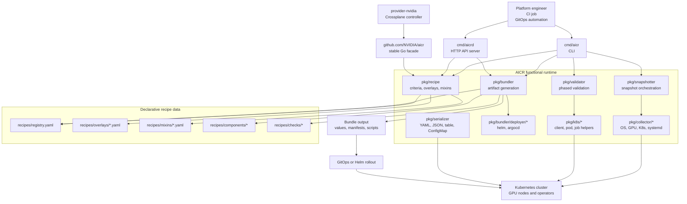
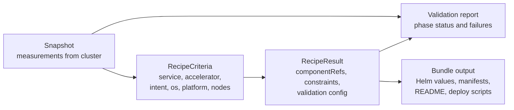
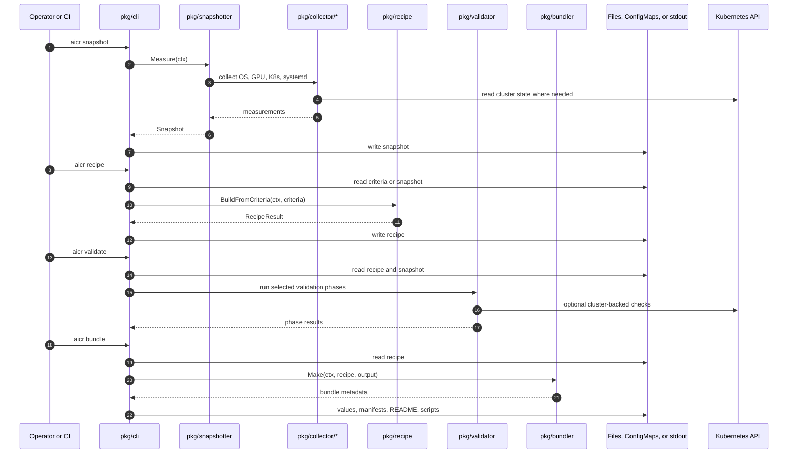
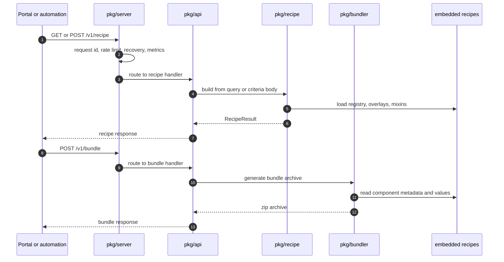
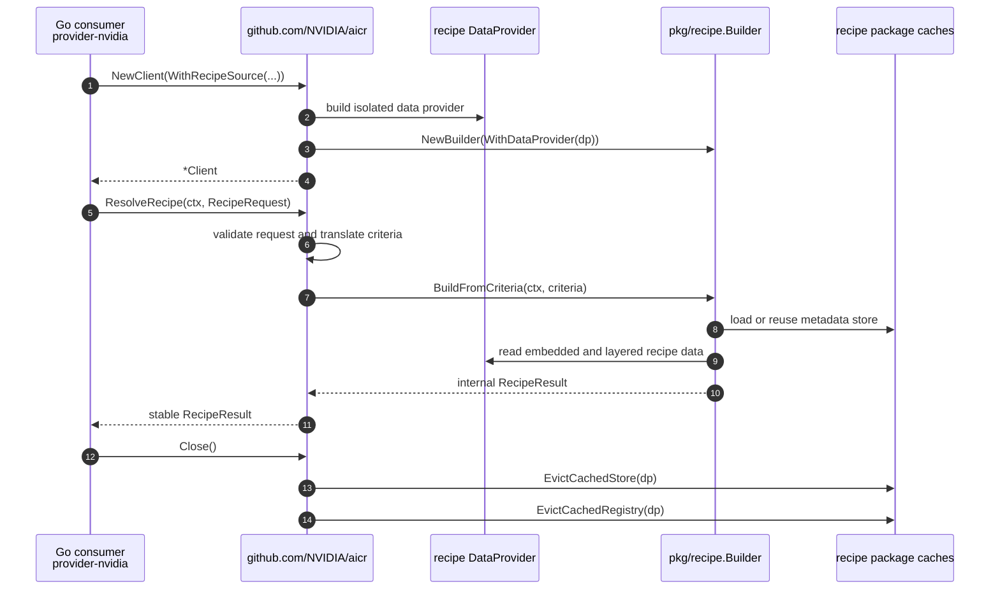
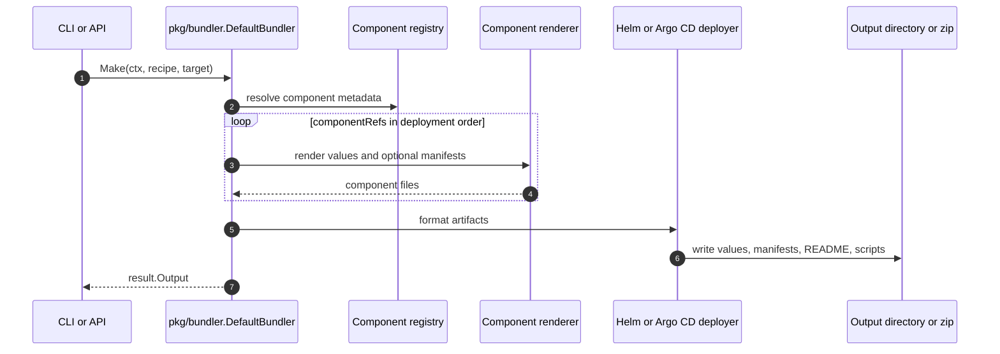
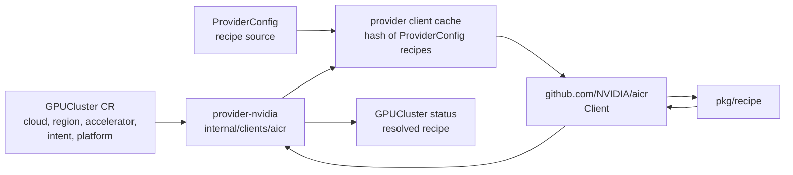

# AICR Architecture Deep Dive

This document describes how AI Cluster Runtime (AICR) is structured, how its
major components cooperate, and how external systems such as
`provider-nvidia` consume it. It is intended for maintainers, integrators, and
reviewers who need to understand where decisions are made, where state is read
or written, and which boundaries are stable.

## Scope

AICR is a configuration decision engine for GPU-accelerated Kubernetes
platforms. It captures observed cluster state, resolves validated recipe data,
validates compatibility, and renders deployable artifacts. AICR can be used as
a CLI, an HTTP API server, or a Go library.

The most important architectural rule is that the user-facing entry points are
thin. The CLI and API server parse intent and format results, while reusable
packages under `pkg/*` own the business logic. External Go consumers should use
the top-level `github.com/NVIDIA/aicr` facade unless they deliberately accept
the higher churn of an evolving `pkg/*` package.

## System View

## Component Responsibilities

| Component | What | When | How | Why |
|-----------|------|------|-----|-----|
| `cmd/aicr` | CLI binary. | Used by operators, CI jobs, and local development. | Delegates commands to `pkg/cli`; does not own business logic. | Gives humans and pipelines a direct workflow for snapshot, recipe, validate, and bundle. |
| `pkg/cli` | CLI command layer. | Runs for each `aicr` command. | Parses flags, builds contexts, calls functional packages, formats output. | Keeps UX concerns separate from reusable logic. |
| `cmd/aicrd` | API server binary. | Used when AICR is deployed as a service. | Calls `pkg/api.Serve`. | Enables central recipe and bundle generation for portals, automation, and multi-team use. |
| `pkg/api` | HTTP route assembly. | Runs inside `aicrd`. | Wires `/v1/recipe`, `/v1/query`, and `/v1/bundle` handlers to recipe and bundler packages. | Keeps HTTP concerns out of core packages. |
| `pkg/server` | HTTP server runtime. | Runs under `pkg/api`. | Adds middleware, request IDs, rate limiting, panic recovery, health, readiness, metrics, and graceful shutdown. | Makes the API server operable in Kubernetes. |
| `github.com/NVIDIA/aicr` | Stable Go facade. | Used by external Go consumers such as `provider-nvidia`. | Owns `Client`, `NewClient`, source options, and stable request/result types. Internally delegates to `pkg/recipe`. | Provides a semver-covered integration boundary while internal packages evolve. |
| `pkg/recipe` | Recipe resolution engine. | Used by CLI, API, and facade when resolving target configuration. | Converts criteria into matched overlays, mixins, constraints, validation phases, and component references. | Encodes validated NVIDIA configuration knowledge as data-driven selection. |
| Recipe data providers | Data source abstraction for recipes. | Used when a client or builder is constructed. | Loads embedded recipe data, optionally layered with filesystem data. OCI is reserved but not wired through today. | Lets the same engine work with release data, local development data, and future remote sources. |
| Recipe metadata cache | Per-data-provider cache for metadata stores and component registries. | Used during recipe resolution. | Keys caches by `DataProvider` identity and evicts through facade `Client.Close`. | Avoids repeated directory walks while preventing cross-client source clobbering. |
| `recipes/registry.yaml` | Component catalog. | Read by recipe and bundler flows. | Declares components, versions, repositories, value keys, and component metadata. | Keeps component knowledge declarative and reviewable. |
| `recipes/overlays/` | Criteria-specific recipe overlays. | Read during recipe resolution. | Matched by asymmetric criteria, then merged in specificity order. | Allows environment-specific configuration without duplicating the base stack. |
| `recipes/mixins/` | Reusable recipe fragments. | Merged into leaf overlays. | Carry shared constraints and component refs for orthogonal dimensions such as OS or platform. | Reduces duplication and makes common policy explicit. |
| `recipes/components/` | Per-component values and manifests. | Read during bundling. | Supplies Helm values and static manifests for component bundles. | Separates rendered deployment details from matching logic. |
| `recipes/checks/` | Health and validation check data. | Used by validation and component checks. | Declares check inputs per component. | Makes validation behavior data-driven. |
| `pkg/snapshotter` | Snapshot orchestration. | Runs for `aicr snapshot` and agent-style collection. | Starts collectors concurrently and emits an all-or-nothing snapshot. | Captures actual state before making or validating recommendations. |
| `pkg/collector/*` | Measurement collectors. | Called by snapshotter. | Reads Kubernetes API, OS files, systemd, GPU data, topology, and related signals. | Converts platform reality into normalized measurements. |
| `pkg/measurement` | Measurement model. | Used by collectors, recipes, validators, and serializers. | Stores typed readings grouped by type and subtype. | Provides one data model for captured facts. |
| `pkg/validator` | Phased validation engine. | Runs for `aicr validate`. | Executes validators by phase and produces CTRF-style phase results. | Separates readiness, deployment, performance, and conformance checks. |
| `validators/*` | Concrete validation programs. | Run as local checks or Kubernetes Jobs depending on mode. | Implement deployment, performance, and conformance checks. | Lets specialized checks evolve independently. |
| `pkg/bundler` | Bundle generation orchestrator. | Runs for `aicr bundle` and `/v1/bundle`. | Reads recipe component refs, registry entries, component values, and deployer config. | Converts abstract recipes into deployable artifacts. |
| `pkg/bundler/config` | Bundle options. | Used when constructing a bundler. | Carries deployer, checksum, README, node scheduling, and override configuration. | Centralizes bundle behavior knobs. |
| `pkg/bundler/deployer/helm` | Helm deployer. | Default bundle output. | Generates per-component folders, values, manifests, README files, and deploy scripts. | Fits direct Helm and shell-based deployment workflows. |
| `pkg/bundler/deployer/argocd` | Argo CD deployer. | Used when `--deployer argocd` is selected. | Generates app-of-apps and per-component Application manifests with ordering annotations. | Fits GitOps workflows and declarative rollout. |
| `pkg/component` | Component helper layer. | Used by bundler internals and tests. | Normalizes component templates, overrides, and generic component behavior. | Keeps bundler orchestration independent from per-component details. |
| `pkg/serializer` | I/O encoding layer. | Used across CLI workflows. | Reads and writes YAML, JSON, tables, files, stdout, HTTP sources, and ConfigMap URIs. | Keeps data transport separate from data semantics. |
| `pkg/k8s/client` | Kubernetes client construction. | Used by collectors, validators, and ConfigMap I/O. | Builds clients from in-cluster config or kubeconfig. | Allows local and in-cluster operation. |
| `pkg/k8s/pod` and `pkg/k8s/agent` | Kubernetes execution helpers. | Used by snapshot agents and validation jobs. | Creates ConfigMaps, Jobs, RBAC, waits for Pods, and fetches logs. | Provides repeatable job-style execution inside clusters. |
| `pkg/manifest` | Manifest rendering. | Used during bundling. | Renders Helm-compatible manifests and templates. | Keeps YAML rendering mechanics in one package. |
| `pkg/oci` | OCI reference and push helpers. | Used by bundle publishing paths. | Parses OCI output targets and pushes packaged artifacts where enabled. | Provides a future-friendly transport for bundles and recipes. |
| `pkg/trust` and `pkg/bundler/attestation` | Supply-chain trust helpers. | Used during release and attested bundle paths. | Handles Sigstore, provenance, and attestation behavior. | Makes artifacts verifiable instead of relying on claims. |
| `pkg/errors` | Structured error model. | Used at API and library boundaries. | Adds stable error codes and contextual details. | Lets callers distinguish invalid input, unavailable features, timeouts, and internal errors. |
| `pkg/defaults` | Shared constants. | Used throughout runtime. | Centralizes timeouts, limits, and default clients. | Prevents hidden divergent defaults. |
| `pkg/logging` | Structured logging setup. | Used by binaries and packages. | Configures slog output and metadata. | Gives operators consistent diagnostic output. |
| `pkg/version`, `pkg/header`, `pkg/build` | Cross-cutting metadata helpers. | Used in validation, server responses, and binary metadata. | Evaluate versions, set headers, and report build info. | Keeps repeated infrastructure concerns small and reusable. |

## Data Model

The snapshot is a captured fact set. Criteria is the normalized intent used to
select recipe data. RecipeResult is the selected target configuration. The
validation report compares intent and facts. Bundle output is the deployable
form of the selected recipe.

## CLI Sequence

## API Server Sequence

The API server is intentionally narrower than the CLI. It serves recipe, query,
and bundle operations. Snapshot capture and full validation remain CLI or
agent-oriented because they require cluster-local collection or job execution.

## Go Library Sequence

The facade currently exposes production recipe resolution with filesystem
recipe sources. OCI source selection is reserved but returns an unavailable
error until the loader is wired through. Consumers should retain clients and
call `Close` when a recipe source is retired.

## Bundle Internal Sequence

The bundler is filesystem-shaped today: it writes complete artifact trees and
returns metadata about those files. Controller-style in-memory bundling is a
separate facade shape and should be designed from the first concrete controller
call site rather than guessed in advance.

## Relationship To provider-nvidia

`provider-nvidia` is not a special code path inside AICR. It is a normal Go
library consumer that imports the top-level facade, constructs one AICR client
per effective ProviderConfig recipe source, resolves a recipe from Kubernetes
CR intent, and writes the resolved recipe identity back to Kubernetes status.

That relationship matters because it creates a clean ownership boundary:

| Boundary | Owned by AICR | Owned by provider-nvidia |
|----------|---------------|--------------------------|
| User intent vocabulary | Criteria values such as `eks`, `gke`, `h100`, `training`, `kubeflow`. | Kubernetes CRD fields such as `spec.forProvider.cloud.provider` and `spec.forProvider.intent`. |
| Recipe selection | Matching overlays, mixins, validation config, and component refs. | Translating CR fields into AICR `RecipeRequest`. |
| Runtime lifecycle | `Client.Close` evicts per-data-provider AICR caches. | ProviderConfig watches decide when cached clients are created, reused, and evicted. |
| Deployment artifacts | CLI/API bundling into files or archives. | Future controller emission of composed resources through Crossplane providers. |
| Compatibility contract | Stable top-level facade plus evolving `pkg/*` packages. | Internal facade that insulates controllers from AICR changes. |

## Use Cases

| Use case | Why AICR fits | Main path | Tradeoff |
|----------|---------------|-----------|----------|
| Local cluster assessment | Operators need to know what hardware and software are actually present. | `aicr snapshot` through `pkg/snapshotter` and collectors. | Requires local privileges or cluster access for meaningful data. |
| Recipe generation in CI | CI can pin known-good GPU stack decisions before rollout. | `aicr recipe` or `/v1/recipe`. | CI must pin AICR and recipe data versions for reproducibility. |
| GitOps bundle generation | Teams want generated Helm or Argo CD artifacts in source control. | `aicr bundle` through `pkg/bundler`. | Generated files must be reviewed like any other deployment change. |
| Central recommendation service | Multiple teams need one controlled API endpoint. | `aicrd` with `/v1/recipe`, `/v1/query`, `/v1/bundle`. | Snapshot and validation remain outside the API server. |
| Crossplane automation | A Kubernetes controller needs recipe decisions during reconcile. | `github.com/NVIDIA/aicr` facade. | The facade intentionally exposes less than the full CLI surface. |
| Custom environment data | Internal platforms need local overlays or component overrides. | Filesystem recipe source layered over embedded data. | Operators must manage recipe data rollout and compatibility. |
| Conformance evidence | Release or certification flows need proof that a stack satisfies checks. | Validators, evidence helpers, and conformance docs. | Some checks require real clusters and cannot be proven by static analysis. |

## Pros And Cons

| Decision | Pros | Cons |
|----------|------|------|
| Data-driven recipes | Reviewable changes, fewer code releases for recipe updates, clear diff surface. | Bad data can still produce bad recommendations, so recipe review and tests are critical. |
| Thin CLI/API over functional packages | Reuse across CLI, API, and library consumers. | Requires discipline to keep business logic out of interaction layers. |
| Stable top-level Go facade | External consumers get a small semver contract. | Consumers may need new facade methods before some internal capabilities are exposed. |
| Per-data-provider caches | Fast repeated recipe resolution and safe concurrent clients. | Consumers must call `Close` or cache memory can grow with retired sources. |
| Filesystem source as production source today | Works for air-gapped, development, and controller-mounted recipe data. | Registry-style distribution is not available until OCI source is implemented. |
| Filesystem-shaped bundler | Produces complete human-reviewable artifacts. | Controllers that need in-memory manifests require a future facade design. |
| Containerized validation | Checks can depend on specialized tools and run inside the target cluster. | Requires RBAC, image availability, and runtime capacity. |
| Asymmetric criteria matching | Generic queries do not accidentally select specialized recipes. | Users must be explicit when they want hardware, OS, or platform-specific behavior. |

## Operational Invariants

| Invariant | Reason |
|-----------|--------|
| Same AICR version plus same recipe data plus same criteria should produce the same recipe. | Reproducibility is required for debugging, review, and regulated rollout. |
| UI packages must delegate business logic to functional packages. | CLI, API, and library consumers need the same decisions. |
| The facade must not mutate process-global recipe state. | Long-running consumers may construct clients for different recipe sources concurrently. |
| AICR clients should be retained and closed. | Construction can perform recipe data loading, and `Close` releases per-provider caches. |
| Recipe "any" can match concrete queries, but query "any" does not match concrete recipes. | This prevents generic requests from selecting specialized configurations by accident. |
| Validation failures should be explicit and structured. | Operators need actionable errors, not only logs. |

## Current Limitations And Follow-Ups

| Area | Current state | Follow-up |
|------|---------------|-----------|
| OCI recipe source | Source option exists, but `NewClient` returns unavailable for OCI today. | Wire OCI loader and define cache invalidation semantics for mutable tags. |
| Pinned recipe facade fields | `PinnedName` and `PinnedVersion` are reserved and rejected today. | Add pinning when the recipe engine supports a stable lookup contract. |
| In-memory controller bundling | CLI/API bundler writes files or archives. | Design an in-memory facade from the first provider-nvidia Phase 2 controller call site. |
| API server scope | API serves recipe, query, and bundle operations. | Snapshot and validation remain CLI/agent workflows unless a secure remote execution model is designed. |
| Validation environment | Cluster-backed validators require RBAC and image access. | Document minimum RBAC and image mirror requirements per deployment model. |
